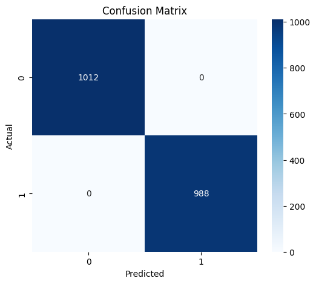
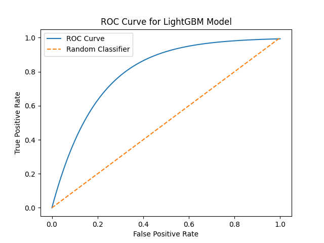

# 🛡️ Machine Learning-Based Intelligent Firewall for Real-Time Threat Detection

## 📌 Overview

This project implements an intelligent firewall system using machine learning to detect and classify malicious network traffic in real time. It enhances traditional rule-based firewalls by incorporating predictive analytics to identify unknown and evolving cyber threats.

---

## 🎯 Objectives

* Detect malicious network traffic using machine learning
* Classify traffic as **benign or attack (intrusion)**
* Improve detection accuracy using **LightGBM with GridSearchCV**
* Provide a scalable approach for real-time firewall systems

---

## ⚙️ Technologies Used

* Python
* LightGBM
* Scikit-learn
* Pandas, NumPy
* Matplotlib, Seaborn

---

## 🧠 Model Details

* Algorithm: **LightGBM (Gradient Boosting)**
* Hyperparameter tuning using **GridSearchCV**
* Data preprocessing using:

  * One-hot encoding
  * Feature scaling
* Evaluation metrics:

  * Accuracy
  * ROC-AUC Score
  * Confusion Matrix

---

## 📊 Dataset

Dataset used: **CICIDS 2018**

🔗 Download link:
https://www.unb.ca/cic/datasets/ids-2018.html

📁 After downloading, place the dataset file inside:

```
data/dataset.csv
```

---

## 🚀 How to Run

### 1. Clone the repository

```
git clone https://github.com/your-username/ml-intelligent-firewall.git
cd ml-intelligent-firewall
```

### 2. Install dependencies

```
pip install -r requirements.txt
```

### 3. Run the model

```
jupyter notebook src/lightgbm_model.ipynb
```

---

## 📈 Results

### 🔹 Confusion Matrix



### 🔹 ROC Curve



---

## 🔐 Features

* Real-time threat detection approach
* ML-based anomaly detection
* Hyperparameter optimization
* Visualization of model performance

---

## 📄 Research Paper

(Add your research paper PDF or link here)

---

## 🔮 Future Work

* Integrate live packet capture (real-time network traffic)
* Deploy as a web-based firewall dashboard
* Use deep learning models for improved detection
* Optimize for large-scale enterprise networks

---

